# T3 Code

T3 Code is an "agent harness control surface". It enables control of the agents on your machine with a best-in-class mobile app ([iOS](https://apps.apple.com/us/app/t3-code-remote-claude-more/id6787819824), [Android](https://play.google.com/store/apps/details?id=com.t3tools.t3code)), [web app](https://app.t3.codes) and [Electron-based desktop app](https://t3.codes).

Works with your subscriptions on Claude Code, Codex, Cursor, Grok Build, OpenCode, and Google Antigravity. If they're set up on your computer, T3 Code can control them.

## "Wait, what are you selling me?"

Nothing. We built T3 Code because we wanted the best possible development experience with agents. We were inspired by existing solutions like the Codex desktop app, Conductor, Claude Desktop and Cursor Glass, but none met our bar.

We wanted something performant, remote-ready, and truly open. If we ever go the wrong direction, we want you to have everything you need to fork and build the editor that you want.

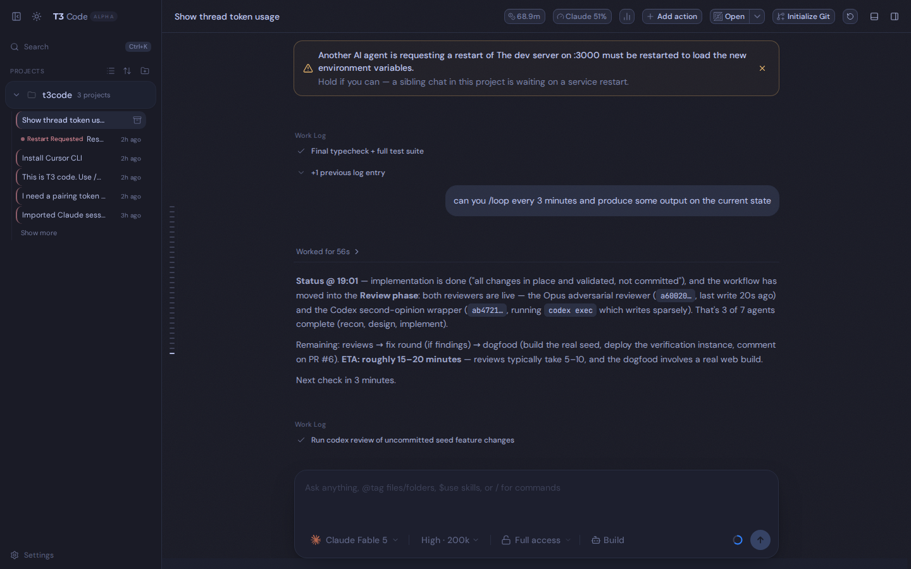

> This is a fork of [pingdotgg/t3code](https://github.com/pingdotgg/t3code) with a batch of extra features on top — selectable color themes, header usage/spend meters, cross-chat AI restart alerts, a flat "chats by activity" sidebar, per-device feature toggles, and an Android build. See [What this fork adds](#what-this-fork-adds).

## Installation

> [!WARNING]
> T3 Code currently supports Codex, Claude, Cursor, Grok Build, OpenCode, and Antigravity. Install and authenticate at least one provider before use:
>
> - Codex: install [Codex CLI](https://developers.openai.com/codex/cli) and run `codex login`
> - Claude: install [Claude Code](https://claude.com/product/claude-code) and run `claude auth login`
> - Cursor: install [Cursor CLI](https://cursor.com/cli) and run `agent login`
> - Grok Build: install [Grok Build CLI](https://x.ai/cli) and run `grok login`
> - OpenCode: install [OpenCode](https://opencode.ai) and run `opencode auth login`
> - Antigravity: enable it in Settings, then use **Install Antigravity** and **Sign in with Google**. No CLI is required.

### Command line

```bash
curl -fsSL https://t3.codes/install.sh | sh
```

On Windows, in PowerShell:

```powershell
irm https://t3.codes/install.ps1 | iex
```

Then run `t3` to start the server and open the local web app. `t3 service install` keeps it running in the background, `t3 update` moves to a newer release, and `t3 --help` has the full reference.

To try it once without installing, run `npx t3@latest` instead.

### Desktop app

Install the latest version of the desktop app from [GitHub Releases](https://github.com/pingdotgg/t3code/releases), or from your favorite package registry:

#### Windows (`winget`)

```bash
winget install T3Tools.T3Code
```

#### macOS (Homebrew)

```bash
brew install --cask t3-code
```

#### Debian, Ubuntu (`.deb`)

Download the `.deb` from [GitHub Releases](https://github.com/pingdotgg/t3code/releases), then:

```bash
sudo apt install ./T3-Code-*.deb
```

#### Arch Linux (AUR)

Stable:

```bash
yay -S t3code-bin
```

Nightly:

```bash
yay -S t3code-nightly-bin
```

The AUR packaging is maintained in this repository under [`packaging/aur`](./packaging/aur).

## What this fork adds

Everything below is additive on top of upstream T3 Code. Screenshots are from a live instance.

### 🎨 Selectable color themes

A **color scheme** axis that is independent of the light/dark toggle. Pick from **Solarized, Dracula, Gruvbox, Catppuccin, and Tokyo Night** — each ships a full light _and_ dark variant — or stay on Default. The scheme re-tints the whole app (sidebar, chat, header) and is applied before first paint, so there's no flash, and it syncs across browser tabs.

Set it in **Settings → General**, right below the light/dark **Theme** control:

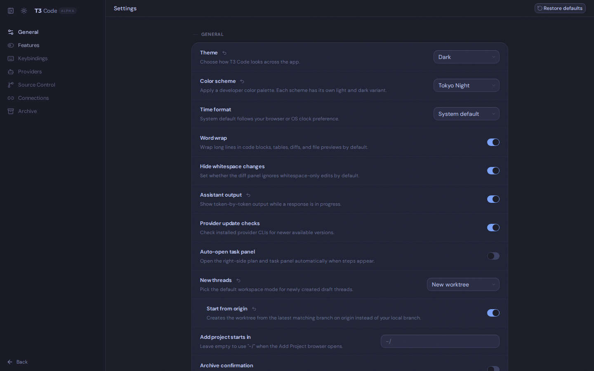

<table>
  <tr>
    <td width="50%">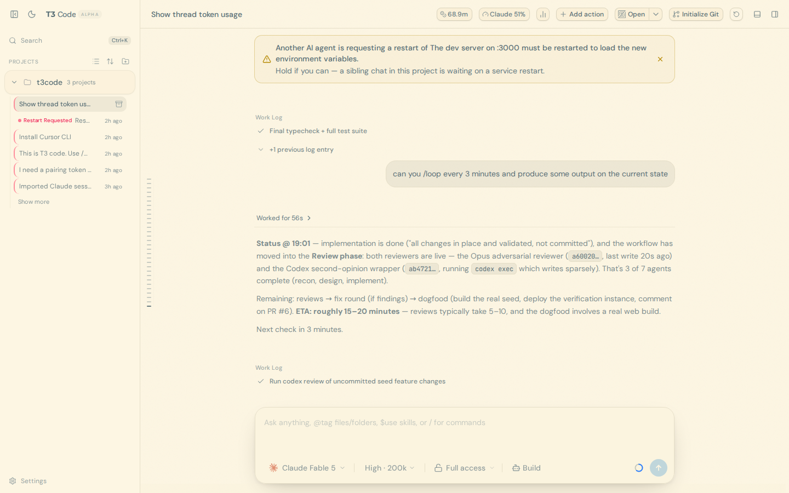<br/><sub><b>Solarized · Light</b></sub></td>
    <td width="50%">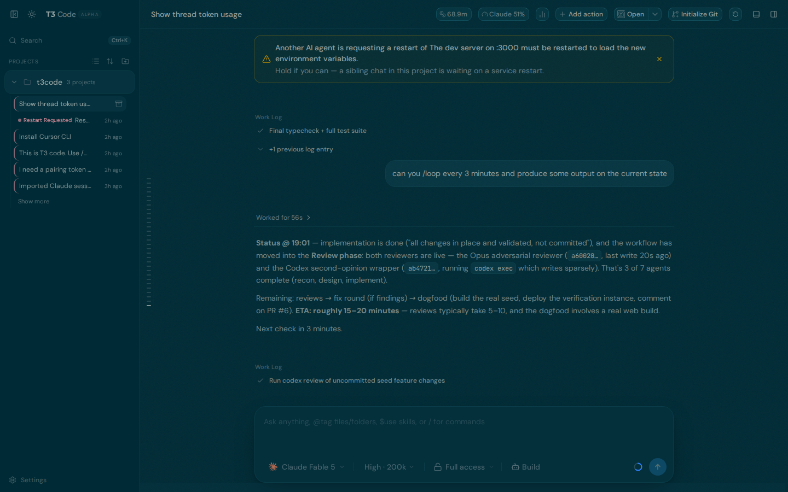<br/><sub><b>Solarized · Dark</b></sub></td>
  </tr>
  <tr>
    <td width="50%">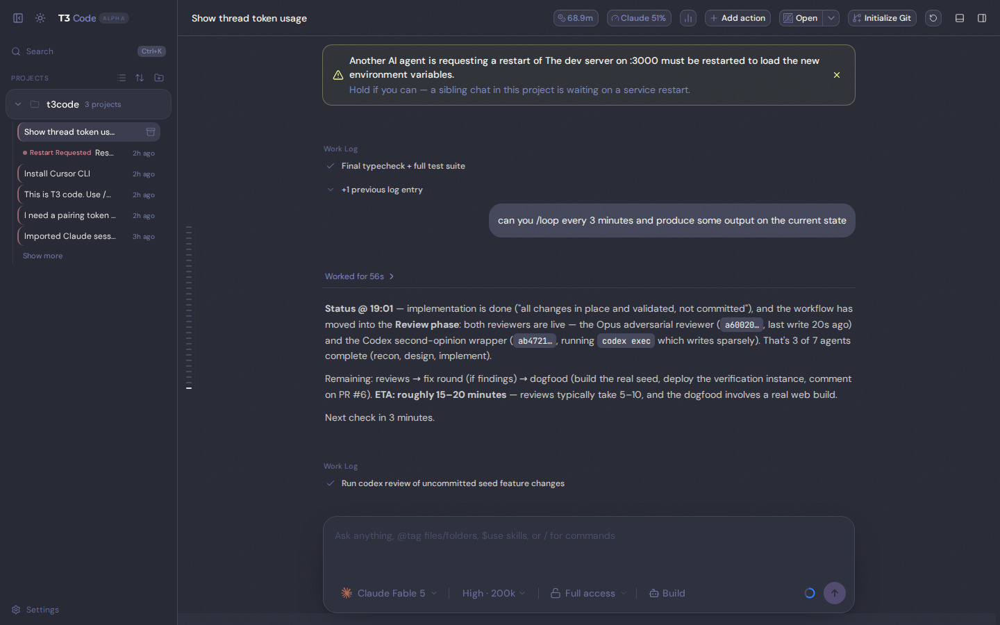<br/><sub><b>Dracula</b></sub></td>
    <td width="50%">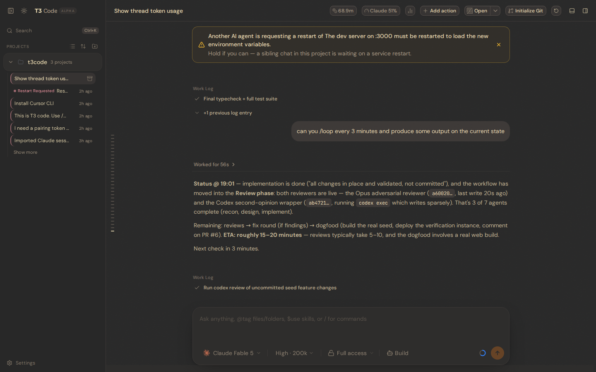<br/><sub><b>Gruvbox</b></sub></td>
  </tr>
  <tr>
    <td width="50%">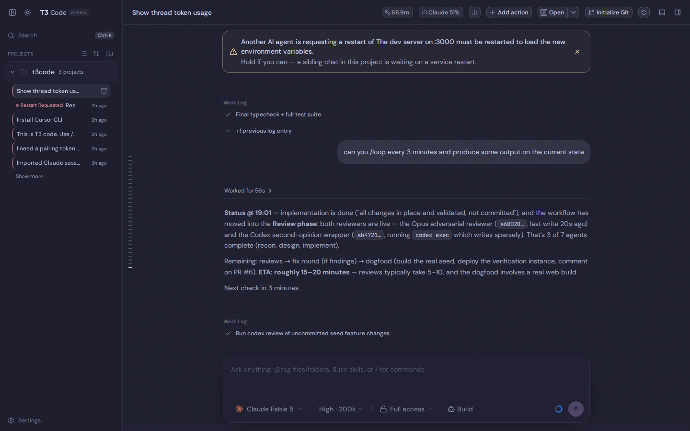<br/><sub><b>Catppuccin</b></sub></td>
    <td width="50%"><br/><sub><b>Tokyo Night</b></sub></td>
  </tr>
</table>

### 📊 Usage, spend & token meters in the header

Keep an eye on how much you're burning without leaving the chat. Small chips in the top bar always show the thread's **token usage** and your **Claude plan usage**; a bar-chart menu lets you switch on larger, color-coded readouts per device: **Context window**, **Spend estimate**, **Claude Session %**, **Claude Weekly %**, and **Codex subscription %**. Hovering a usage tile shows a countdown to when that limit window resets.

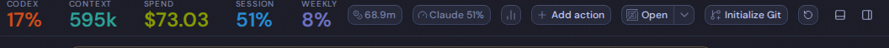

The **Codex** meter reads your Codex CLI subscription's rate-limit usage passively from local rollout files — no extra API calls — so it even reflects out-of-band `codex exec` runs. Toggle any stat from the header menu:

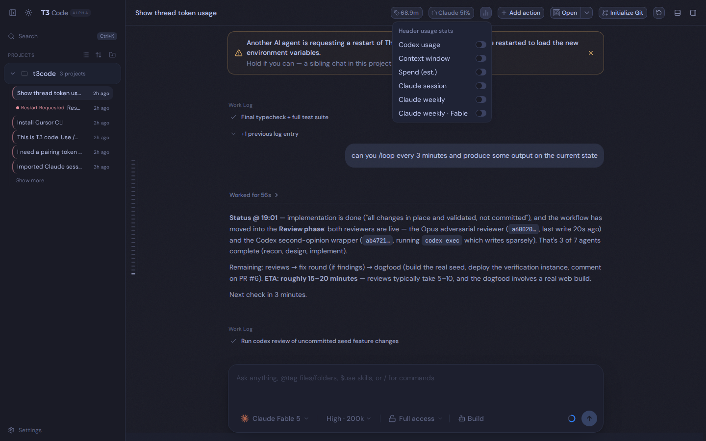

### 🔁 Cross-chat AI restart alerts

When an agent asks you to restart the service it's working on, T3 Code surfaces it so your _other_ chats on the same project don't stomp on the restart. The requesting chat gets a banner with a **Mark resolved** action, its sidebar row shows a **Restart Requested** pill, and sibling chats get a "hold" banner. It auto-clears when you reply in the requesting chat.

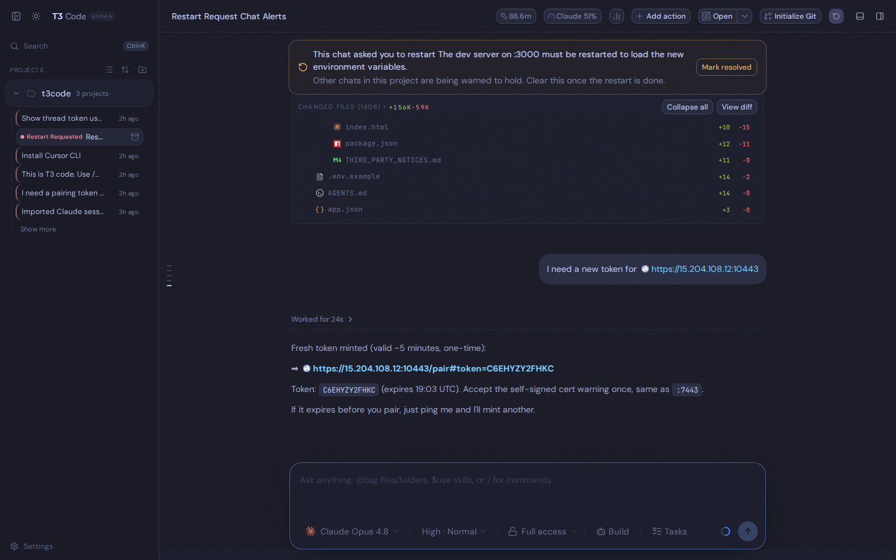

### 🗂️ "Chats by activity" sidebar

Flip the sidebar from the grouped project tree into a single flat list of every chat, ordered by last activity, with each row tagged by its project. The choice persists per device.

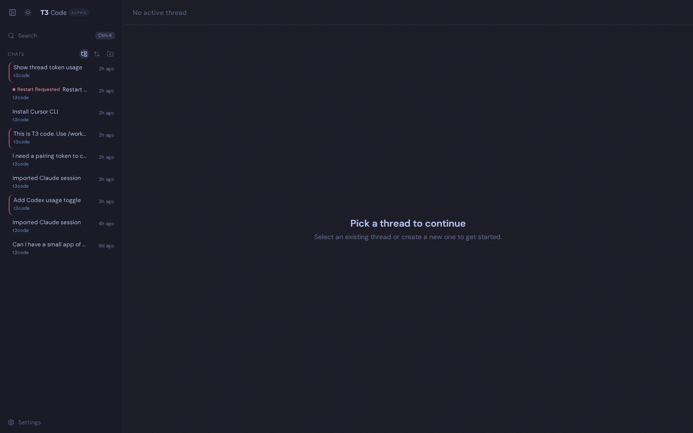

### ⚙️ Per-device feature toggles

A **Settings → Features** page with auto/show/hide toggles for the chat header's action controls — Git actions, Open in editor, and Project scripts. "Auto" shows them on desktop and hides them on mobile-width screens. Stored per device.

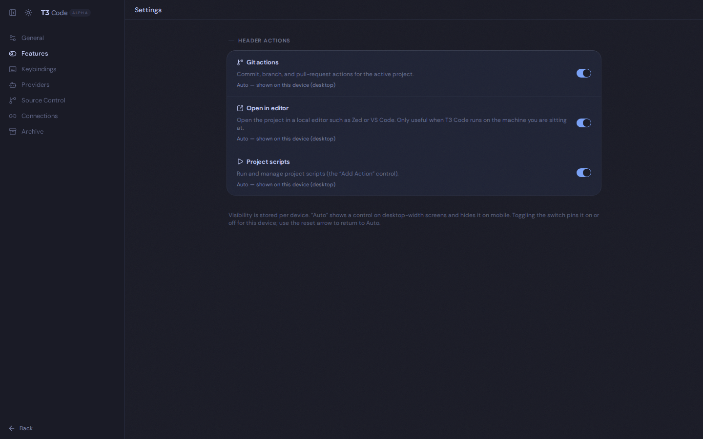

### And more

- **Resumable Claude Code conversation import** — `t3 import claude <session>` turns an existing Claude Code transcript into a resumable T3 thread, forking to a new transcript so your original session is untouched.
- **Missing-transcript diagnostics** — when a Claude thread can no longer be resumed because its `~/.claude/projects/…/<session>.jsonl` is gone (host reprovisioned, thread imported from another machine), the thread shows exactly which file is missing instead of a generic stream failure. `t3 session audit` lists every affected thread with the path to restore; `t3 session reset <threadId> --yes` is the explicit opt-in to start that thread over with a fresh Claude session.
- **Android app** — a full native Android build (Ghostty terminal, Shiki-highlighted code blocks, themed native chrome, self-signed-TLS trust, sideload APK publish script).
- **File explorer collapsed by default**, and a fix so the **left edge of message lines is selectable**.

## Some notes

We are very very early in this project. Expect bugs.

We are (mostly) not accepting contributions yet. Small fixes may be considered. Big features will not be.

## Documentation

Full docs live in [docs/](./docs). There's no docs site yet.

- [Install and first run](./docs/user/install.md)
- [Permission modes](./docs/user/permission-modes.md)
- [Keyboard shortcuts](./docs/user/keybindings.md)
- [Project settings](./docs/user/project-settings.md)
- [Appearance preferences](./docs/user/appearance.md)
- [Remote access from a phone or another machine](./docs/user/remote-access.md)
- [Keeping app and server in sync](./docs/user/updating.md)
- [Source control integrations](./docs/user/source-control.md)
- Multiple accounts: [Codex](./docs/user/providers-codex.md) · [Claude](./docs/user/providers-claude.md)
- [Run T3 Code as a background service](./docs/user/background-service.md)

Building from source? Start at [docs/internals/overview.md](./docs/internals/overview.md).

## Contributing

### Install `vp`

T3 Code uses Vite+ so you'll need to install the global `vp` command-line tool.

#### macOS / Linux

```bash
curl -fsSL https://vite.plus | bash
```

#### Windows

```bash
irm https://vite.plus/ps1 | iex
```

Checkout their getting started guide for more information: https://viteplus.dev/guide/

### Install dependencies

```bash
vp i
```

Read [CONTRIBUTING.md](./CONTRIBUTING.md) before reporting a bug or opening a PR.

Have a feature request? Start an [Ideas discussion](https://github.com/pingdotgg/t3code/discussions/categories/ideas).

Need support? Join the [Discord](https://discord.gg/jn4EGJjrvv).
